<div dir="rtl">

# توضیح آزمایش ها:
# 1. مدل پایه (base):
> مدل پایه یک مدل CNN است که شامل چهار لایه کانولوشنی میشود بین هر لایه MAXpooling , relu, BatchNorm اعمال شده
> لایه کلاسیفایر یا fully connected شامل یک adaptiveAveragePool در ابتدا با خروجی 1×1 است سپس با گذشتن از Flatten به اولین لایه Linear میرسد که ورودی با سایز 256(feature maps) دارد و خروجی آن به سایز256 است 
> بعد از اعمال کردن تابع relu به لایه خطی آخر داده میشود که ورودی آن 256 و خروجی آن برابر تعداد کلاس هاست که در این مسئله 8 کلاس داریم 

# مسیر حرکت تصویر در شبکه پایه :
```python
# ======layer-1=========
out_conv1 = self.conv1(x)
out_norm1 = self.norm1(out_conv1)
out_relu = self.relu(out_norm1)
out_max_pool1 = self.max_pool(out_relu)
# =======layer-2=========
out_conv2 = self.conv2(out_max_pool1)
out_norm2 = self.norm2(out_conv2)
out_relu2 = self.relu(out_norm2)
out_max_pool2 = self.max_pool(out_relu2)
# =======layer-3=========
out_conv3 = self.conv3(out_max_pool2)
out_norm3 = self.norm3(out_conv3)
out_relu3 = self.relu(out_norm3)
out_max_pool3 = self.max_pool(out_relu3)

# =======layer-4=========
out_conv4 = self.conv4(out_max_pool3)
out_norm4 = self.norm4(out_conv4)
out_relu4 = self.relu(out_norm4)
out_max_pool4 = self.max_pool(out_relu4)
# =======FC-layer=========
out_fc = self.head(out_max_pool4)
```
>لازم به ذکر است این شبکه بدون augmentation آموزش دیده و هیچ امکانات اضافه ای ندارد و سنگ محک ما برای ارزیابی بخش های دیگر است که شامل آگمنتیشن و تکنیک های regularization هستند

## تصویر ذیل عملکرد این مدل در ایپوک های 1 تا 8 است :
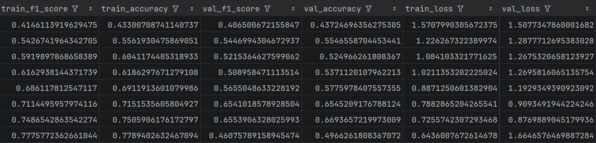

> تفسیر تصویر به شرح زیر است:
> همان طور که قابل مشاهده است بهترین لاسی که مدل توانسته برای train دستیافته 0.64 است و برای validation تنها به 0.87 دستیافته این نشان دهنده ترکیبی از underfitting ناشی از ضعف مدل در یادگیری و overfitting ناشی از افت عملکرد در داده های آموخته نشده است  
> در آزمایش های بعدی سعی میشود با تست مدل های قوی تر برای بالاتر رفتن ظرفیت مدل و تکنیک های ساده سازی برای جلوگیری از بیش برازش استفاده کنیم 


# 2. مدل با Augmentation:
> در این آزمایش با تکنیک غنی سازی داده ها ، سعی میکنیم از هر تصویر چند
> نمونه متفاوت ایجاد کنیم تا شبکه به shortcut ها و زاویه
> های خاص یا BackGround خاص وابسته نشود و سعی در درک مفهوم شی موجود در تصویر کند 
> تمام معماری و مسیر حرکت تصویر در این شبکه با مدل Base تطابق دارد با این تفاوت که
> داده هایی که به شبکه خورانده شده دارای Augmentation هستند ، همچنین به صورت on the fly پیش رفتیم به این معنا که نمونه های
> آگمنت شده جایی روی دیسک ذخیره نخواهند شد 

# تصویر ذیل عملکرد مدل در طول 8 ایپوک بوده : 
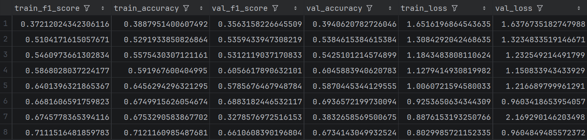
> تفسیر تصویر :
> همان طور که قابل مشاهده است با نمایش تصاویر متنوع تر به مدل ، باعث کاهش گپ بین train,validation شدیم
> اما دقت کلی مدل در train اندکی کاهش داشته ؛ با توجه به اینکه دقت validation بهبود داشته
> (accuracy بهتر ولی loss یکسان) و مهم ترین مطلب عملکرد مدل در داده های
> unseen است ، میتوان نتیجه گرفت که Augmentation مفید بوده و توانسته در  Generalization مفید باشد.
> بهترین لاس train: 0.80 
> بهترین لاس validation: 0.96


# 3. Dropout: 
> در این آزمایش از Dropout استفاده کردیم 
> ، این روش در لایه ای که اعمال میشود به طور تصادفی N  درصد از خروجی های آن لایه رو غیر فعال میکند
> ، این عمل باعث میشود مدل به یکسری مسیر ها در 
> شبکه متکی نشود و سعی کند به کمک تمام شبکه عملکرد خود را ارائه دهد 
> در این آزمایش از دو مقدار 0.3 و 0.5 به عنوان مقادیر تست میزان اعمال dropout استفاده کردیم 

# معماری مدل به شرح زیر است : 
```python
# Layer 1
out_conv1 = self.conv1(x)
out_norm1 = self.norm1(out_conv1)
out_relu1 = self.relu(out_norm1)
out_max_pool1 = self.max_pool(out_relu1)

# Layer 2
out_conv2 = self.conv2(out_max_pool1)
out_norm2 = self.norm2(out_conv2)
out_relu2 = self.relu(out_norm2)
out_max_pool2 = self.max_pool(out_relu2)

# Layer 3
out_conv3 = self.conv3(out_max_pool2)
out_norm3 = self.norm3(out_conv3)
out_relu3 = self.relu(out_norm3)
out_max_pool3 = self.max_pool(out_relu3)

# Layer 4
out_conv4 = self.conv4(out_max_pool3)
out_norm4 = self.norm4(out_conv4)
out_relu4 = self.relu(out_norm4)
out_max_pool4 = self.max_pool(out_relu4)

# Classifier Head
out_fc = self.head(out_max_pool4)
return out_fc

Dropout: 
# ===== Classifier Head =====
self.head = nn.Sequential(
nn.AdaptiveAvgPool2d((1, 1)),
nn.Flatten(),
nn.Linear(in_features=256, out_features=256),
nn.ReLU(),
nn.Dropout(p=dropout_rate),                            <--------------
nn.Linear(in_features=256, out_features=num_classes))
```
> بین لایه اول و دوم fully connected از dropout  استفاده شده تا N درصد خروجی های لایه اول را به صورت رندوم غیر فعال کند 

# بررسی عملکرد مدل در 8 ایپوک 0.3:
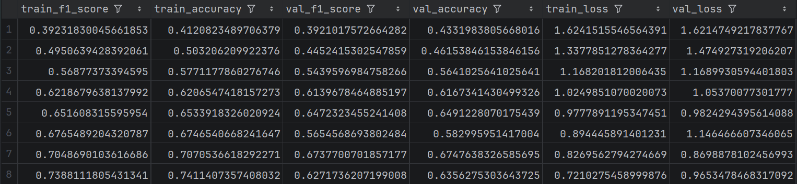
> تفسیر :
> استفاده از این روش نسبت به سنگ محک ما ( base ) نتیجه بهتری ارائه داده
> میشه نتیجه گرفت بر اساس بهترین لاس train و validation استفاده از dropout  
> باعث این شده که مدل Generalization بهتری داشته باشه البته این تغییرات خیلی محدود هستن و تفاوت مشهودی
> ایجاد نکردن چون به نظر میرسه مشکل اصلی فعلا ظرفیت کم مدل باشه 
> نکته مثبتی که در این باره وجود داره کاهش لاس Validation نسبت به مدل پایه هست که نشون میده تونستیم گپ بین ترین و تست
> رو با دراپ آوت 0.3 کاهش بدیم در عین حال لاس train کمی بالارفته که نشان دهنده تاثیر منفی
> Generalization هست زمانی که مدل ظرفیت کافی برای یادگیری نداره  
> بهترین لاس train: 0.72
> بهترین لاس validation: 0.86
# بررسی عملکرد مدل در 8 ایپوک 0.5:
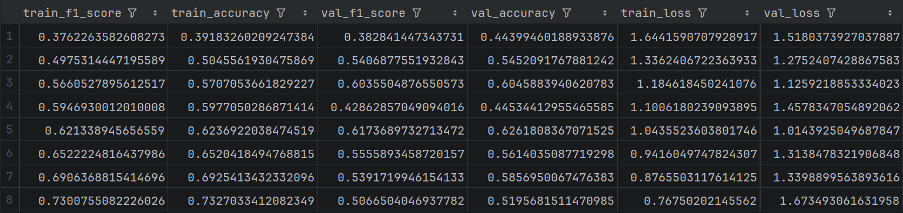
> تفسیر:
> اینجا وضعیت کاملا تغییر میکنه ، به نظر میاد تاثیر dropout کاملا منفی هست و باعث شده لاس validation
> خیلی بد بشه در عین حال لاس train هم بالا برده استنباط من از این قضیه این هست که با غیرفعال
> کردن 50 درصد خروجی ها بیش از حد چشم مدل رو بستیم و باعث شدیم مدل به سمت ترکیبی از undefit overfit بیشتر بره 
> بهترین لاس train: 0.76
> بهترین لاس validation: 1.0


# 4. Average Pooling:
> در این آزمایش به جای MaxPooling بین لایه ها از AveragePooling استفاده کردیم 
> Max از پنجره ای که مشاهده میکند قوی ترین مولفه را استخرج میکند ولی average یک میانگین و درک عمومی از هر پنجره استخارج میکند و نوع 
> اطلاعاتی که منتقل میکند متفاوت است 
> در این آزمایش تاثیر این تغییر در عملکرد مدل را بررسی میکنیم

## مسیر حرکت تصویر در شبکه آزمایش:
```python
# Layer 1
x = self.averagepool(self.relu(self.norm1(self.conv1(x))))
# Layer 2
x = self.averagepool(self.relu(self.norm2(self.conv2(x))))
# Layer 3
x = self.averagepool(self.relu(self.norm3(self.conv3(x))))
# Layer 4
x = self.averagepool(self.relu(self.norm4(self.conv4(x))))

# FC Head
return self.head(x)
```
# بررسی عملکرد در طول 8 ایپوک :
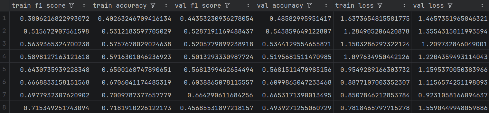

بهترین لاس train: 0.78
بهترین لاس validation: 0.92

> تفسیر : استفاده از این روش باعث شده لاس ترین
> و لاس ولیدیشن افزایش پیدا کنه به علت اینکه به جای استخراج مولفه های قوی میانگینی از هر خروجی کرنل ها استخراج شده 


# 5. Learning Rate Scheduler:
> در این روش طی فرایند آموزش  کم کم نرخ یادگیری کاهش پیدا میکند ، ایده پشت قضیه این است که مدل
> در ابتدا نیاز به گام های بزرگتری دارد تا به همگرایی برسد و در گام های پایانی نیاز به قدم های کوچک و دقیق دارد
> لذا هدف از این آزمایش بالابردن ظرافت اصلاح مدل در گام های آخر است تا به عملکرد دقیق تری برسد 

> معماری این مدل مشابه base است ولی طی فرایند آموزش از یک تابع مخصوص برای کاهش تدریجی لرنینگ ریت استفاده شده 
> scheduler = torch.optim.lr_scheduler.StepLR(optimizer=optimizer, step_size=3, gamma=0.1)
> این تابع آخر هر ایپاک با فرمان .step() نرخ یادگیری اپتیمایزر رو کاهش میده تا گام های کوچک تری بردارد.

## نمایش عملکرد مدل طی 8 ایپوک : 
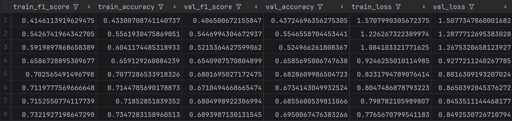

> تفسیر عملکرد:
> این روش در ابتدا باعث کاهش گپ بین ترین و تست شده ، در عین حال که
> لاس ترین رو افزایش داده باعث کاهش لاس ولیدیشن شده ! و از انجایی که هدف بهینه سازی مدل 
> و به دست آوردن عملکرد بهتر روی داده های دیده نشده است ، این آزمایش موفق بوده 
> بهترین لاس train: 0.77
> بهترین لاس validation: 0.84

# 6. Weight Decay:
> در این آزمایش از روش Weight Decay استفاده کردیم : کارکرد این روش به شرح زیر است :
> این عمل  با هدف جلوگیری از overfitting  انجام میشود ، چون این شبکه ها پارامتر های زیادی دارند امکان دارد نویز ها را حفظ کنند  ، 
> این کار باعث میشود با کوچک نگه داشتن وزن ها جلوی حساسیت بالا
> به نویز ها و تغییرات کوچک را بگیریم 
> مکانیزم این کار به این صورت است که :
> در هر گام وزن ها رو کاهش میده که همین امر باعث میشه اپتیمایزر رو مجبور کنه وزن ها رو کوچک نگه داره
> پس میشه گفت با جریمه کردن بزرگ تر برای وزن های بزرگ ، باعث میشه کوچک شدن وزن باعث کاهش لاس بشود 
## عملکرد مدل در طی 8 ایپاک
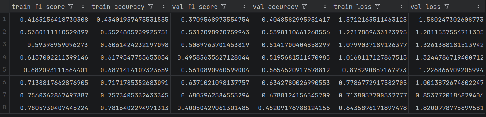
بهترین لاس train: 0.64 epoch --> 8
بهترین لاس Validation: 0.85  epoch --> 7

همان طور که مکانیزم این روش رو توضیح دادم ، باعث میشه مدل وزن های خیلی بزرگی نداشته باشه 
طبق گزارشات ایپاک ها مدل عملکرد نسبتا بهتری نسبت به مدل base داشته ! اما مانند تمام 
آزمایش های دیگری که روی استراکچر base انجام دادیم عملکرد نهایی به طور چشم گیری بهتر نمیشود 
و این مسئله نشان میدهد که نیاز جدی ما یک مدل با ساختار با ظرفیت بالاتر است.


# 7. Imbalance dataset:
> در این آزمایش مدل با بدون بالانس شدن کلاس ها آموزش دیده و
> این امر باعث شده به کلاس هایی که فراوانی بیشتری دارند توجه بیشتری بکند 
> ، لذا هدف ما در این آزمایش بررسی تاثیر این مسئله روی مدل است
>در ضمن این imbalance از طریق غیر فعال کردن BalanceSampler روی loader مجموعه train اتفاق می افتد .
## بررسی عملکرد مدل طی 8 ایپاک:
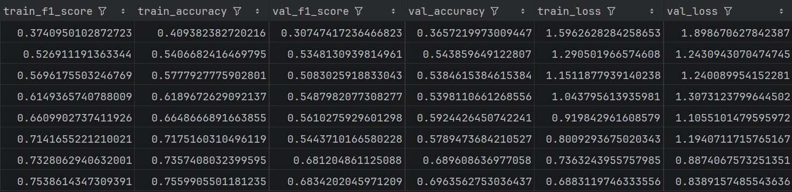

> طبق گزارش های ایپاک ها ، مدل عملکرد مشابه مدل های دیگر داشته و تفاوت در اینجا قابل مشاهده نیست 
## لازم دانستم با توجه به مسئله مورد بررسی confusion matrix رو هم به گزارش اضافه کنم
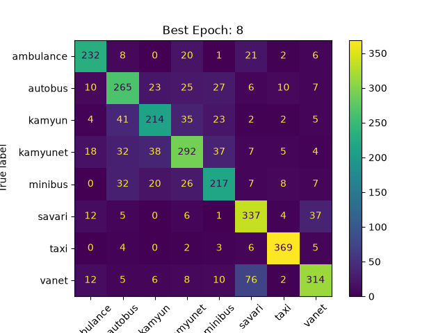
> کلاس های سواری ، وانت و تاکسی از بقیه کلاس ها فراوان تر هستند،
> طبق کانفیوژن ماتریس تعداد زیادی وانت با خودرو سواری اشتباه گرفته شدند یعنی 76 نمونه و
> عملکرد کلی مدل روی کلاس ها خوب نبوده و خیلی از کلاس ها را با هم ترکیب کرده و اشتباه لیبل زده است که
> هم ناشی از برابر نبودن تعداد نمونه ها بوده هم ناشی از ظرفیت پایین مدل در کل خودرو های سنگین با هم اشتباه گرفته شدند


# 8. Resnet Freeze:
> در این آزمایش از مدل resnet آموزش دیده روی یک میلیون تصویر imagenet استفاده کردیم و head مدل رو با تعداد کلاس های مسئله یکی کردیم
> همچنین head مدل trainable است ولی Backbone مدل کاملا فریز است حتی running statistic ها کاملا ثابت می مانند

# بررسی عملکرد مدل طی هشت ایپاک :
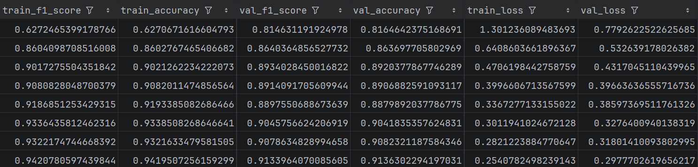

بهترین لاس train: 0.25
بهترین لاس validation: 0.29

> عملکرد مدل بسیار عالی بوده و توانسته بدون overfitting همزمان عملکرد روی هر دو مجموعه داده را بالا ببرد 
> بنابراین با افزایش دادن ظرفیت مدل و استفاده از مکانیزم Residual connection به طور همزمان که جلوی محو شدن سیگنال گرادیان را میگیرد 
> توانستیم مدلی بسازیم  که به خوبی توانسته داده ها را یادبگیرد و عملکرد عالی روی همه کلاس ها داشته باشد تا به  اینجا این اولین آزمایشی بوده که توانسته چالش مسئله ما را حل کند
> این امر نشان میدهد که داده های پیچیده مربوط به تفکیک کلاس خودرو ها نیاز به مدلی با ظرفیت بالا دارد 

# 9. Resnet Finetune:
> گاهی در استفاده از شبکه های pretrained از finetunning استفاده میکنیم ، چرا که لایه های آخر مدل دارای ویژگی های اختصاصی مربوط به مسئله هدف است و با آموزش مجدد آخرین لایه مدل ، سعی میکنیم تا جای ممکن مدل را با تسک خود تطبیق دهیم
> در این آزمایش ما Layer4 شبکه Resnet  را همراه با head آموزش دادیم ، و میخواهیم بررسی کنیم که این مسئله آیا میتواند باعث دستیافتن به دقتی حتی 
> بهتر از آزمایش قبل شود یا ممکن است باعث فراموشی فاجعه آمیز شود ؟ 


## بررسی عملکرد مدل طی 8 ایپاک :
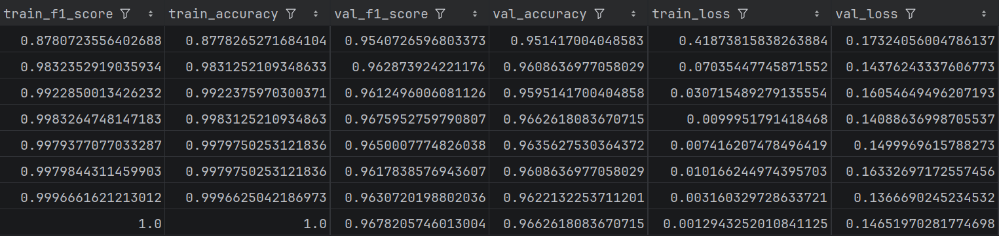
بهترین لاس train: 0تقریبا
بهترین لاس validation: 0.14

> این عملکرد ، فوق العاده ترین نتیجه بین تمام آزمایش ها بوده میشود به وضوح نتیجه گرفت که نه degradation problem نه overfitting نه catastrophic forgetting رخ داده 
> میشود از همین جا نتیجه گرفت بهترین  مدل ما همین fine-tune شبکه resnet هست ولی این قضاوت را به عملکرد روی داده های تست واگذار میکنیم 

# بررسی عملکرد TEST:
</div>

